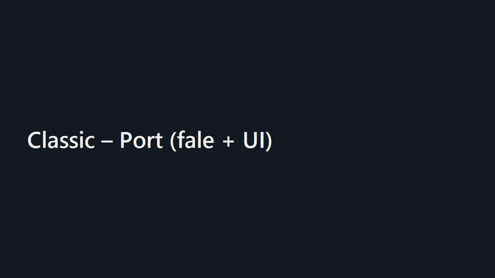
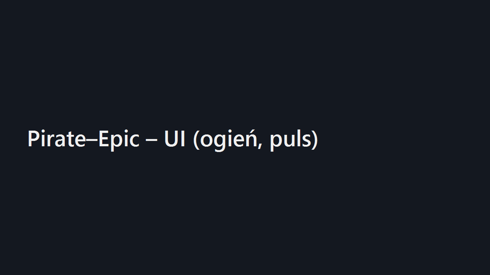
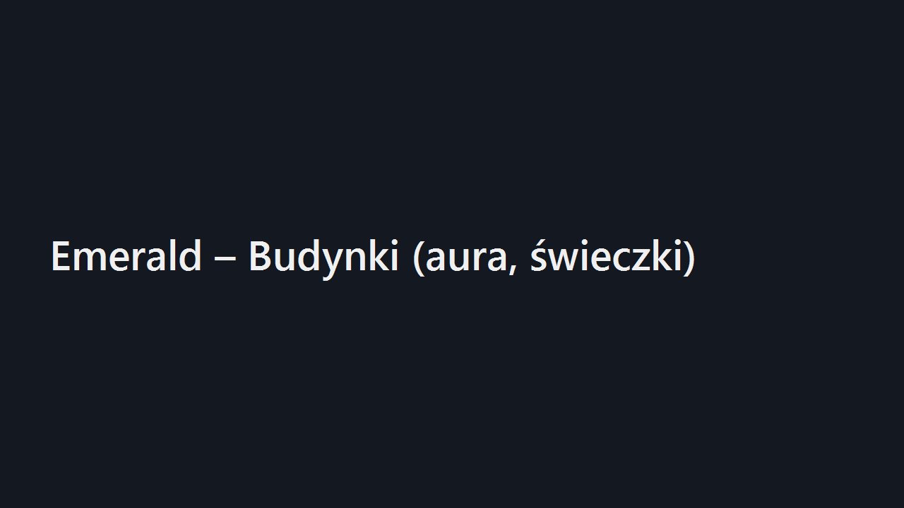

  
  <h1>Aegis – Grepolis Remaster</h1>
  
Motywy, UI 2025, ekran powitalny, fajerwerki ✨

---

## Funkcje
- Nowy motyw CSS (czcionki, panel, tło, przyciski z połyskiem).
- Wersja odznaki (prawy górny róg).
- Ekran powitalny + fajerwerki (pierwsze uruchomienie po aktualizacji).
- 3 motywy: **classic**, **pirate-epic**, **emerald**; skrót: <kbd>Ctrl</kbd>+<kbd>Alt</kbd>+<kbd>T</kbd>.
- Loader CSS bez migotania.

## Instalacja
- Zainstaluj Tampermonkey.
- Otwórz userscript:  
  https://raw.githubusercontent.com/KID6767/Aegis/main/userscripts/grepolis-skin-switcher.user.js
- Wejdź do Grepolis → zobaczysz ekran powitalny i badge wersji.  
- Przełączanie motywu: <kbd>Ctrl</kbd>+<kbd>Alt</kbd>+<kbd>T</kbd>.

## Zrzuty (placeholdery)

  
  
  

---