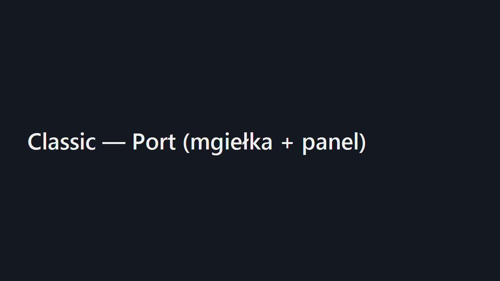
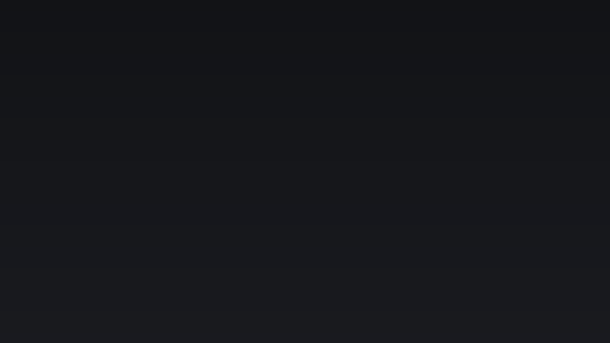
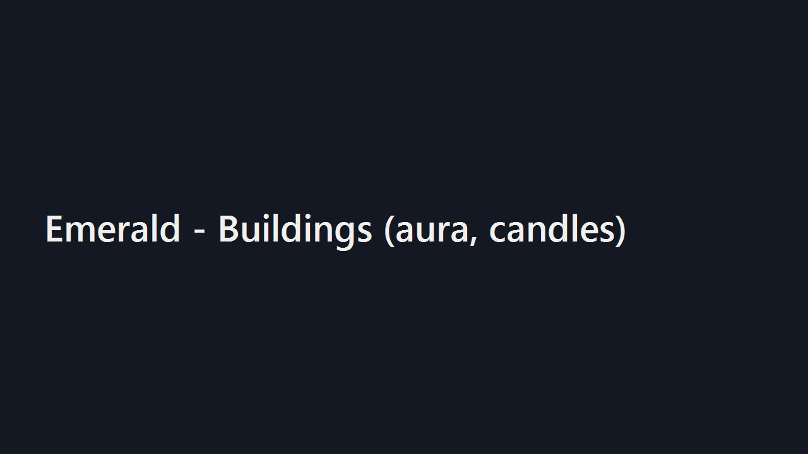
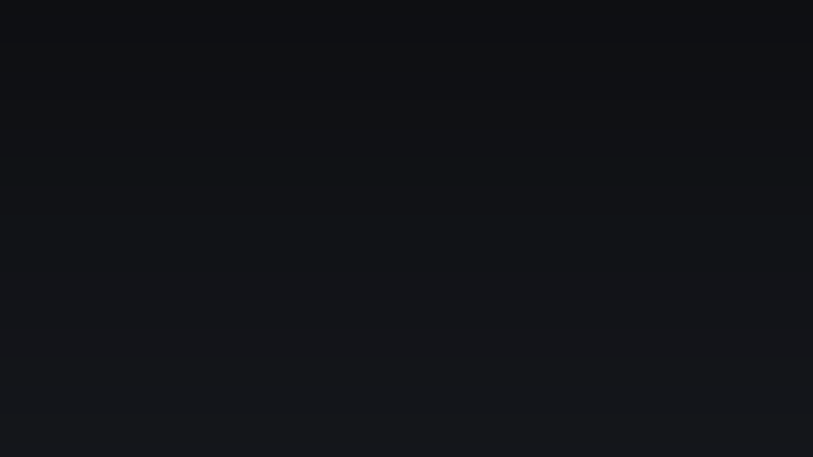

# 

# Aegis — Grepolis Remaster 2025 (v0.6.1-stable)

Pełny wizualny remaster Grepolis: trzy motywy (Classic / Pirate-Epic / Emerald), animacje (fale, ogień, aura, chorągwie, świeczki), @2x grafiki i Dark Mode.

## Instalacja (Tampermonkey)
1. Zainstaluj rozszerzenie **Tampermonkey**.
2. WejdĹş w RAW link i kliknij **Install**:
   **https://raw.githubusercontent.com/KID6767/Aegis/main/userscripts/grepolis-skin-switcher.user.js**
3. W grze (prawy-dolny rĂłg) panel **Aegis**: wybĂłr motywu, Dark, Refresh.

## Galeria (1280Ă—720)
**Classic – Port (fale + nowe UI)**  

**Pirate-Epic – UI (ogień, ciemny motyw, pulsujące ikony)**  

**Emerald – Budynki (neonowa aura, glify, świeczki)**  

**Mapa świata (mgiełka + efekty bitewne)**  

## Struktura
- ssets/themes/<theme>/{ theme.css, theme-anim.css }
- ssets/(units|buildings|ui)/<theme>/<nazwa>.png i <nazwa>@2x.png
- ssets/sprites/ — sprite’y (spark/flag/candle/fire)
- config/mapping.json — mapowanie podmian
- userscripts/grepolis-skin-switcher.user.js — skrypt Tampermonkey

Autor: **KID6767** — Licencja: MIT
