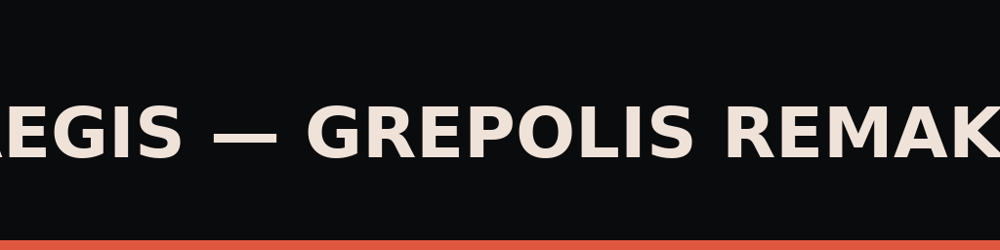

# Aegis — Grepolis Remaster 2025

Nowa era Grepolis: skiny, motywy, animacje i pełny branding.

## Instalacja
1. Zainstaluj [Tampermonkey](https://www.tampermonkey.net/).
2. Kliknij: [Aegis 1.0.1](https://raw.githubusercontent.com/KID6767/Aegis/main/userscripts/grepolis-aegis.user.js)
3. Odśwież Grepolis.

## Funkcje
- Epickie motywy (Classic, Remaster, Pirate, Dark)
- Panel konfiguracji (złoty kwadrat w prawym górnym rogu)
- Animowany ekran powitalny z fajerwerkami
- Subtelny dym w tle dla klimatu
- AssetMap — łatwe podmienianie grafik
- Automatyczne ładowanie z GitHub + aktualizacje

## Grafiki

---
MIT — darmowe i otwarte
