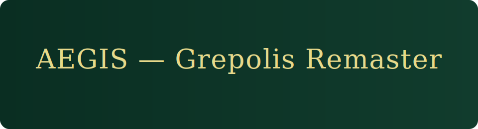

# Aegis — Grepolis Remaster (1.0.1)

Butelkowa zieleń + złoto, pasek konfiguracji (prawy-dolny róg), modal z podglądem brandingu.

## Szybki start
1. Zainstaluj **Tampermonkey**.
2. Otwórz RAW userscript (po wrzuceniu do GitHuba):  
   `https://raw.githubusercontent.com/KID6767/Aegis/main/userscripts/grepolis-aegis.user.js`
3. Kliknij **Install** w Tampermonkey i odśwież Grepolis.

## Motywy
- classic / remaster / pirate / dark

## Branding / AssetMap
- `assets/branding/banner.svg` — baner (animowany)
- `assets/branding/ship_green.svg`, `ship_pirate.svg`
- `assets/branding/spinner.gif`, `gold_dot.png`

Podmieniasz pliki → push → userscript je pobierze z RAW.